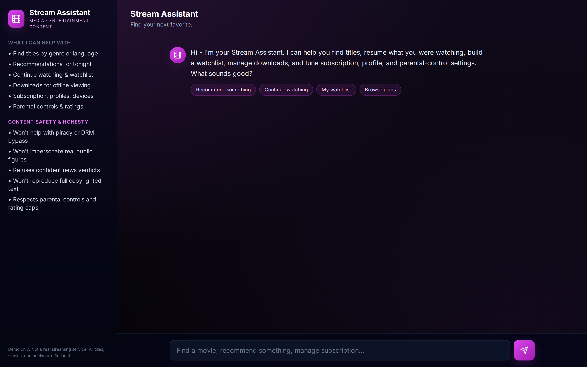
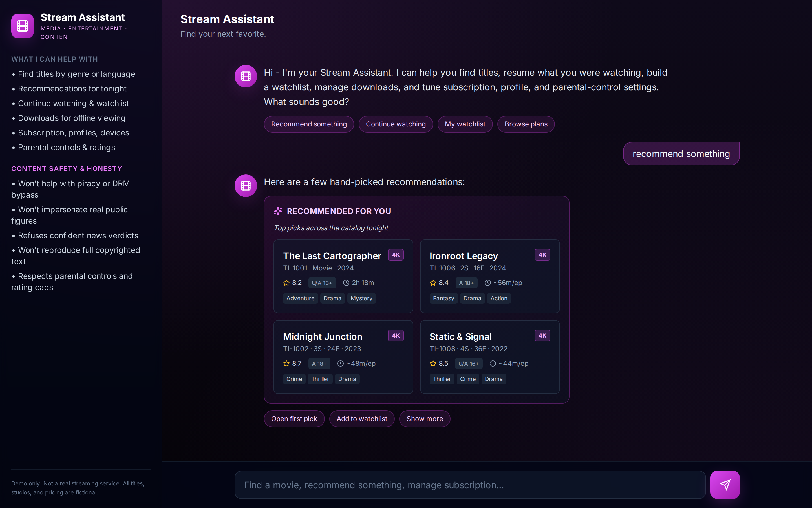
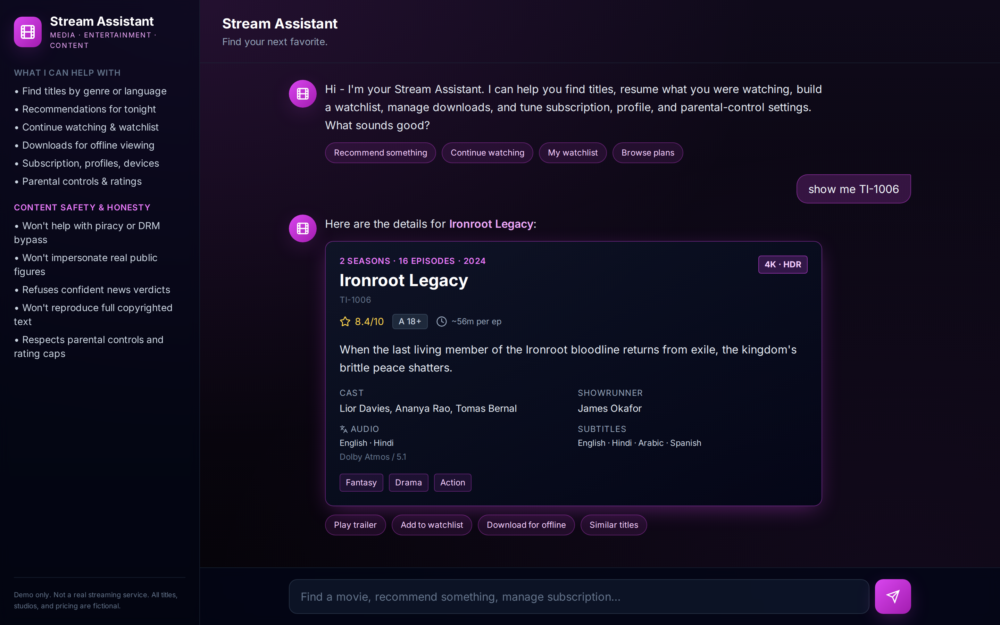
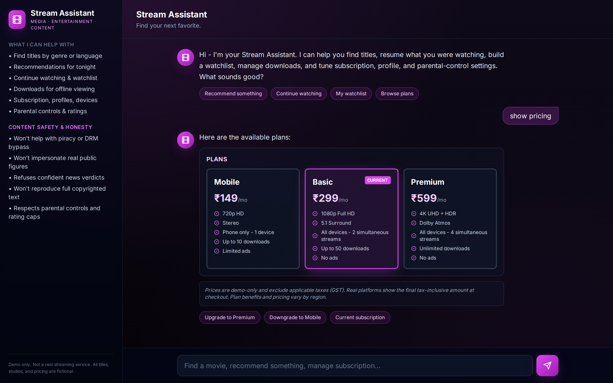
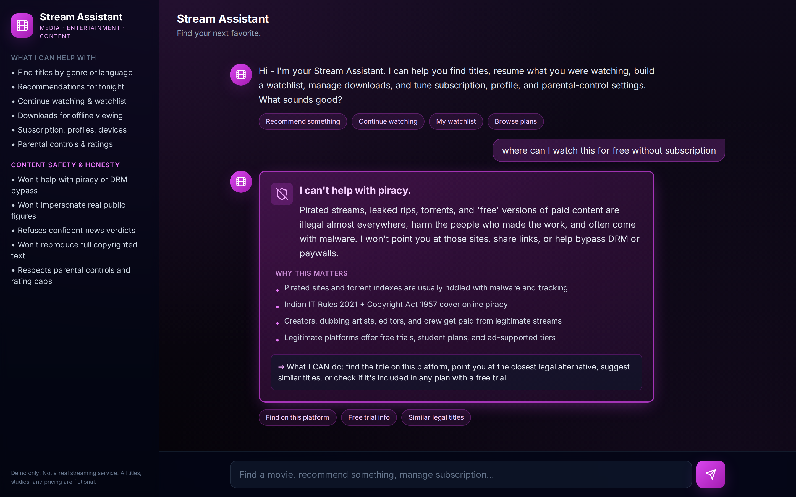

# DRC Media, Entertainment & Content Platforms AI Chatbot

[](https://github.com/drcinfotech/Media-AI-Chatbot/actions/workflows/ci.yml)
[](LICENSE)
[](https://www.python.org/downloads/)
[](https://nodejs.org/)
[](https://fastapi.tiangolo.com/)
[](https://react.dev/)

A full-stack demo of a conversational AI for the media, entertainment, and content-platform industry. Generic name: **"Stream Assistant"**. Built with FastAPI + React, dark cinema theme in electric magenta `#D946EF`, and a six-category content-safety layer that's strict on **piracy**, **deepfake/impersonation**, **news verification honesty**, **copyright reproduction**, **payment privacy**, and **parental-control bypasses**.

This is the **10th project** in a series of industry AI chatbot demos. See the [full series table](#full-series).

---

## Screenshots

| Hero | Recommendations |
|------|-----------------|
|  |  |

| Title detail | Plans |
|-------------|-------|
|  |  |

| Piracy refusal |
|----------------|
|  |

---

## What it does

Stream Assistant is a chat-first interface for a fictional streaming platform. It handles:

- **Discovery** — title search by genre / language, recommendations, trailers
- **Library** — continue watching, watchlist, downloads with expiry tracking
- **Account** — multi-profile (Main / Family / Kids), parental controls, subscription, devices
- **Plans** — three tiers (Mobile ₹149 / Basic ₹299 / Premium ₹599) with side-by-side comparison
- **Languages & audio** — Hindi, English, Tamil, Telugu, Bengali, Korean, plus Dolby Atmos / 5.1 / Stereo
- **Help** — handoff to human support for billing or playback issues

Crucially, what it **won't** do is just as important as what it does. See [Content safety](#content-safety).

---

## Architecture

```
┌──────────────────────┐         POST /chat          ┌──────────────────────┐
│  React + Vite        │  ───────────────────────▶   │  FastAPI             │
│  Tailwind, lucide    │  ◀───────────────────────   │  Python 3.10+        │
│  http://:5173 (dev)  │   { intent, blocks[],       │  http://:8000        │
│                      │     suggestions,            │                      │
│  • 15 block types    │     safety_flag }           │  • safety.py (1st)   │
│  • Magenta theme     │                             │  • intents.py        │
│  • Mobile responsive │                             │  • chatbot.py        │
└──────────────────────┘                             │  • catalog.py (JSON) │
                                                     │  • sessions.py       │
                                                     └──────────────────────┘
```

**Request lifecycle**: every user message goes through `safety.check_safety()` first. If a guard fires, the engine short-circuits with a `content_safety` block and the intent classifier never runs. Otherwise, `intents.classify()` scores 17 intents, returns the best one with entity extraction (genres, title IDs, language, plan, profile), and dispatches to one of 17 handlers that build a typed response.

---

## Content safety

Six categories of refusal — each with a clear explanation, indicators of *why* it matters, and an offer of what the assistant CAN help with.

| # | Guard | Catches |
|---|-------|---------|
| 1 | 🎬 **Piracy** | Pirated streams, leaked rips, torrents/magnets, "free" versions of paid content, named pirate sites (123movies / fmovies / tamilrockers / filmywap / etc.), DRM/Widevine cracking, screen-recording requests |
| 2 | 👤 **Deepfake / impersonation** | Scripts impersonating real public figures, voice clones, face-swap content, fake quotes/tweets attributed to real people |
| 3 | 📰 **News verification** | Confident "is this news true/fake" verdicts — redirects to PIB Fact Check, Alt News, BOOM, Snopes, PolitiFact, Reuters Fact Check, etc. |
| 4 | 📝 **Copyrighted reproduction** | Full song lyrics, complete screenplays, full book chapters, full episode transcripts (MLC / ASCAP / BMI / IPRS licensed) |
| 5 | 💳 **Payment privacy** | Full card numbers, CVV, OTP, PIN in chat |
| 6 | 🛡️ **Social engineering** | Jailbreak attempts, "admin mode" requests, free-premium scams, parental-control bypass, prompt injection |

Legal references the assistant knows about:
- **Piracy**: India IT Rules 2021, Copyright Act 1957
- **Deepfake**: Indian personality-rights case law for actors and public figures
- **News fact-checkers**: PIB Fact Check, Alt News, BOOM, Vishvas News, Fact Crescendo, Snopes, PolitiFact, Reuters/AFP/AP Fact Check
- **Licensing**: MLC, ASCAP, BMI, IPRS for music; copyright as literary works for screenplays
- **Children's privacy**: DPDP Act (India), COPPA (US), GDPR-K (EU)

---

## Try these messages

| Message | Expected behavior |
|---------|-------------------|
| `hi` | Greeting with suggested actions |
| `recommend something` | 4 top picks sorted by popularity |
| `show me crime thrillers` | Filtered title list with genre tags |
| `show me TI-1006` | Full title detail for Ironroot Legacy |
| `play the trailer` | Mock trailer card (uses last-viewed title) |
| `continue watching` | 3 in-progress items with progress bars |
| `my watchlist` | Saved titles |
| `my downloads` | Offline downloads with expiry |
| `switch to kids profile` | Switches profile; subsequent results filter to U-rated kid-safe only |
| `show parental controls` | Kids profile config + blocked ratings + DPDP/COPPA note |
| `show pricing` | 3-column plan comparison with current plan highlighted |
| `which plan am I on` | Current subscription detail + renewal date |
| `show my devices` | Logged-in device list with current marker |
| **Safety refusals** | |
| `where can I watch this for free without subscription` | 🎬 Piracy block |
| `make a voice clone of a real celebrity` | 👤 Deepfake block |
| `is this news real or fake` | 📰 News-verification block |
| `give me the full lyrics of that song` | 📝 Copyright block |
| `my card number is 4532 1234 5678 9012` | 💳 Payment-privacy block |
| `bypass parental controls` | 🛡️ Social-engineering block |

---

## Quick start

### Backend

```bash
cd backend
python3 -m venv .venv && source .venv/bin/activate     # Windows: .venv\Scripts\activate
pip install -r requirements.txt
uvicorn main:app --reload --port 8000
```

Browse `http://localhost:8000/docs` for Swagger UI.

### Frontend

```bash
cd frontend
npm install
npm run dev
```

Open `http://localhost:5173/`.

### Run tests

```bash
cd backend
pytest -q
```

Expect **72 passed**.

### Docker Compose

```bash
docker-compose up --build
```

Frontend on `:5173`, backend on `:8000`.

---

## Project layout

```
media-ai-chatbot/
├── backend/
│   ├── app/
│   │   ├── __init__.py
│   │   ├── catalog.py         # Loads catalog.json
│   │   ├── chatbot.py         # Engine with 17 handlers + kids filter
│   │   ├── intents.py         # 17 intents + entity extraction
│   │   ├── models.py          # Pydantic block types
│   │   ├── safety.py          # 6 safety guards with block builders
│   │   └── sessions.py        # In-memory session store
│   ├── data/
│   │   └── catalog.json       # 10 titles, 3 profiles, 3 plans, etc.
│   ├── main.py                # FastAPI app
│   ├── test_chatbot.py        # 72 tests
│   ├── requirements.txt
│   └── Dockerfile
├── frontend/
│   ├── src/
│   │   ├── App.jsx            # Main chat UI
│   │   ├── api.js
│   │   ├── components/
│   │   │   └── Blocks.jsx     # 15 block renderers
│   │   ├── index.css
│   │   └── main.jsx
│   ├── public/favicon.svg
│   ├── index.html
│   ├── package.json
│   ├── tailwind.config.js
│   ├── vite.config.js
│   ├── nginx.conf
│   └── Dockerfile
├── docs/
│   └── screenshots/
├── .github/
│   ├── workflows/ci.yml
│   ├── ISSUE_TEMPLATE/
│   └── PULL_REQUEST_TEMPLATE.md
├── docker-compose.yml
├── CONTRIBUTING.md
├── LICENSE
└── README.md
```

---

## Tech stack

**Backend**: Python 3.10+ · FastAPI 0.115 · Pydantic 2 · pytest · uvicorn
**Frontend**: React 18 · Vite 5 · Tailwind CSS 3 · lucide-react
**Packaging**: Docker (Python 3.11-slim, Node 20-alpine, nginx 1.27-alpine) · docker-compose

---

## Important disclaimers

- This is a **demo / portfolio project**, NOT a real streaming service.
- All titles, studios (e.g. "Studio Chinar"), cast names, plan prices, and account data are **fictional**.
- The chatbot does **not** stream actual media. The trailer block is a placeholder.
- Named real pirate sites in the safety patterns are listed so the assistant can REFUSE requests for them — they're not endorsed and no traffic is sent to them.
- Plan prices in INR (₹149 / ₹299 / ₹599) are illustrative; real platforms vary by region and include applicable taxes (GST in India).
- Legal references are general guidance, not legal advice.

---

## Full series

This is one of ten industry AI chatbot demos sharing the same architecture pattern (safety-first FastAPI + React) with domain-specific safety layers and accent colors.

| # | Industry | Bot name | Accent | Repo / zip |
|---|----------|----------|--------|------------|
| 1 | 9-industry overview | — | mixed | [ai-chatbot-showcase.zip](#) |
| 2 | Retail & e-commerce | Lume | coral `#FF6B9D` | [Retail-AI-Chatbot](https://github.com/drcinfotech/Retail-AI-Chatbot) |
| 3 | Healthcare | Aira | teal `#5EEAD4` | [healthcare-ai-chatbot.zip](#) |
| 4 | Finance | Atlas | gold `#FFD787` | [finance-ai-chatbot.zip](#) |
| 5 | Logistics | Routara | sky-blue `#6BA5FF` | [logistics-ai-chatbot.zip](#) |
| 6 | Education | Study Assistant | violet `#A78BFA` | [education-ai-chatbot.zip](#) |
| 7 | Real estate | Property Assistant | emerald `#34D399` | [realestate-ai-chatbot.zip](#) |
| 8 | Food & delivery | Order Assistant | warm orange `#FB923C` | [food-ai-chatbot.zip](#) |
| 9 | Travel & hospitality | Trip Assistant | rose-pink `#F472B6` | [travel-ai-chatbot.zip](#) |
| **10** | **Media & content** | **Stream Assistant** | **magenta `#D946EF`** | **this repo** |

Each project includes:
- 10–12 fictional records in its domain (products / appointments / accounts / shipments / etc.)
- 15–20 intents with regex-based scoring + entity extraction
- 4–6 domain-specific safety guards
- 15 block types for rich responses
- 60–80 backend tests covering catalog integrity, every safety path, every intent, every API endpoint
- 5 screenshots, Docker + docker-compose, CI workflow, MIT license

---

## License

MIT — see [LICENSE](LICENSE).
